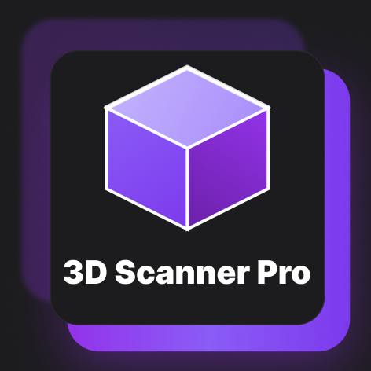

# Scanner 3D Pro


## Overview

Scanner 3D Pro is a comprehensive Flutter application designed to control a 3D scanning solution built with a Raspberry Pi, camera, and linear laser. The application provides a complete workflow for 3D scanning, from hardware control to file management and 3D model visualization.

## Features

### 🔐 Authentication
- **User Registration**: Create a new account with email and password
- **User Login**: Secure authentication with Supabase backend

### 📡 Device Connectivity
- **Wi-Fi Connection**: Connect to the Raspberry Pi scanner via Wi-Fi 
- **Device Status**: Real-time status monitoring of connected hardware
- **TF-Luna Distance Sensor**: Live distance measurements integration

### 📷 Scanning Controls
- **Camera Feed**: Live video stream from the Raspberry Pi camera
- **Laser Control**: Toggle the linear laser on/off
- **RGB/HSV Filters**: Advanced color filtering for optimal scan results
- **Scan Progress Tracking**: Real-time feedback during scanning process

### 📁 3D Model Management
- **File Gallery**: Browse and manage your 3D scans
- **Upload**: Add STL files from your device
- **3D Viewer**: View STL files in interactive 3D
- **File Operations**: Rename, share, and delete 3D models
- **Cloud Storage**: Secure storage of scan files in Supabase

## Installation


### Installation Steps

#### Manual Installation (Development)
1. Clone the repository:
   ```bash
   git clone https://github.com/yourusername/scanner_3d_pro.git
   cd scanner_3d_pro
   ```

2. Install dependencies:
   ```bash
   flutter pub get
   ```

3. Connect your device and run:
   ```bash
   flutter run
   ```

#### Building for Release
```bash
flutter build apk --release  # For Android
flutter build ios --release  # For iOS
```

## Usage Guide

### First-Time Setup
1. **Create an Account**: Register with your email and a secure password
2. **Connect to Scanner**: Ensure your mobile device is connected to the same Wi-Fi network as your Raspberry Pi scanner
3. **Pair Device**: On the Live View screen, tap "Connect" to pair with the scanner

### Scanning Process
1. **Position Object**: Place your object on the scanner turntable
2. **Adjust Distance**: Use the TF-Luna distance reading to position at optimal scanning distance
3. **Tune Settings**: Adjust RGB/HSV filters if needed for better laser line detection
4. **Start Scan**: Press the "Start Scan" button and wait for the scanning process to complete
5. **Save & View**: Once finished, the scan will be saved automatically and available in your files gallery

### Managing 3D Models
- **View Models**: Navigate to the Files screen to see all your 3D models
- **Preview**: Tap the eye icon to open the 3D viewer
- **Share**: Use the share icon to generate shareable links or export files
- **Rename/Delete**: Manage your files with the provided file operations

## Technical Architecture

### Frontend
- **Flutter**: Cross-platform UI framework
- **WebView**: For rendering 3D models using Three.js

### Backend
- **Supabase**: Authentication, file storage, and database
- **Raspberry Pi Server**: Custom API for hardware control

### 3D Visualization
- **Three.js**: JavaScript library for 3D rendering
- **Custom STL Parser**: For 3D file format support

## Future Improvements


### Advanced Visualization

- Advanced editing capabilities within the app
- Support for more 3D file formats (OBJ, GLTF, etc.)

### User Experience

- Guided workflow for new users
- Scan presets for different object types


### Cloud Integration

- Integration with 3D printing services

## Contributing

Your reviews or suggestions are welcome! Feel free to reach us at: `ybaleh13@gmail.com | jas.gagnard@gmail.com`  
Use the subject: `Scanner 3D Pro|XXXXX`

Where `XXXXX` can be one of the following (not exhaustive):
- Correction
- Addition
- Review
- Upgrade
